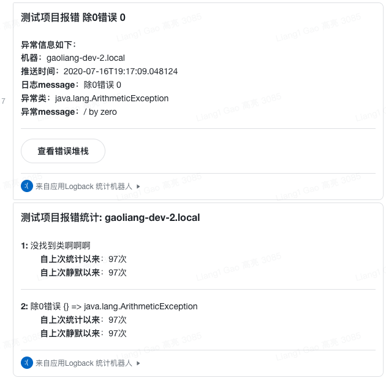

# 飞书logback错误日志转发机器人

基于 https://github.com/eclecticlogic/whisper 修改而来

### 使用方式
修改 `me/gaoliang/feishuappender/logback/FeishuMessageWriter.java:48` 处的配置，构建jar包

在logback配置文件中接入
```xml
<appender name="feishu" class="me.gaoliang.feishuappender.logback.FeishuAppender">
    <filter class="ch.qos.logback.classic.filter.ThresholdFilter">
        <level>ERROR</level>
    </filter>
    <!-- 错误出现多少次后静默不再报警, 去重的 key 为 「error 的 message（非格式化的，也就是{}未被解析）加 异常的类名（如果有）」-->
    <suppressAfter>3 in 5 minutes</suppressAfter>
    <!-- 没有报错后多长时间后静默结束-->
    <expireAfter>4 minutes</expireAfter>
    <!-- 如果有报错，多久发一次报错统计邮件 -->
    <digestFrequency>60 seconds</digestFrequency>
    <!-- 项目的名字 -->
    <projectName>我的项目</projectName>
    <!-- 接收报警的用户名单，用逗号分割 -->
    <alertUserIds>xxxx</alertUserIds>
</appender>
 
<!-- 配置为异步发送的 appender -->
<appender name="asyncFeishu" class="ch.qos.logback.classic.AsyncAppender">
    <filter class="ch.qos.logback.classic.filter.ThresholdFilter">
        <level>ERROR</level>
    </filter>
    <appender-ref ref="feishu"/>
</appender>
 
<!-- 在需要的地方引用appender -->
<appender-ref ref="asyncFeishu"/>

```
如果需要在飞书中查看错误堆栈，查看： https://github.com/gaoliang/feishu-appender-mp

### 打日志的注意事项：
默认的去重key策略为 log 的message（未格式化的） + 异常的类全限定名（如果有异常）

所以，你不应该使用字符串拼接来输出日志，而应该采用格式化的方式

例如：
```java

// 不会被去重拦住
log.error("error on id: " + 1);
log.error("error on id: " + 2);
```
```java
// 捕获到重复，成功拦截
log.error("error on id: {}", 1)
log.error("error on id: {}", 2)
 
 
// 此时的去重 key 为 "error on id: {}"
```

对于异常堆栈的打印，你应该将异常放到 log.error 的最后一个参数，并无需对他进行任何格式化操作。
```java
try {
    pass
}
catch (SomeException ex) {
    log.error("{}, {}! An exception occurred!",
    "Hello",
    "World",
     ex);
}

 
// 此时去重的key为 "{}, {}! An exception occurred! java.lang.Exception"
```
